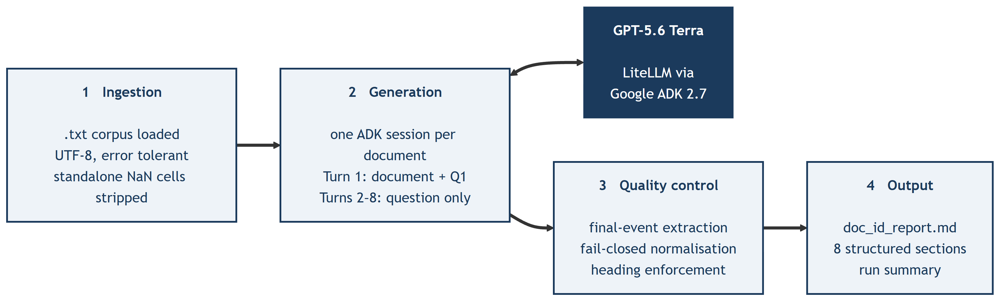

# Doc QA

Generates best-practice guidance reports from text documents. Each document is answered
against eight fixed questions, using only what the document says. When the text does not
support an answer, the report says `Not found in document.` instead of filling the gap.

Built on [Google ADK](https://adk.dev/). Any model reachable through
[LiteLLM](https://docs.litellm.ai/) works; the default is `openai/gpt-5.6-terra`.

## Install

Requires Python 3.13 or newer and [uv](https://docs.astral.sh/uv/).

```bash
uv sync                    # runtime only
uv sync --all-groups       # plus test and lint tooling
cp .env.example .env       # then fill in the API key for your model
```

## Run

```bash
uv run doc-qa run                          # process every .txt in DOCS_DIR
uv run doc-qa run --model gemini-2.5-flash # override the model for one run
uv run doc-qa run --no-overwrite           # leave existing reports alone
uv run doc-qa run --dry-run                # show the plan, call nothing
uv run doc-qa list-docs                    # what would be processed
```

Every flag overrides the matching environment variable, which in turn overrides `.env`.
The command exits non-zero if any document failed, and names the ones that did.

## Configuration

| Variable | Default | Meaning |
|---|---|---|
| `ADK_MODEL` | `openai/gpt-5.6-terra` | Provider-prefixed names route through LiteLLM; bare names go to ADK's Gemini registry |
| `OPENAI_API_KEY` / `GOOGLE_API_KEY` | — | Only the one matching `ADK_MODEL` is required, and it is checked at startup |
| `DOCS_DIR` | `data` | Where the input `.txt` files live |
| `OUT_DIR` | `data/outputs` | Where `{doc_id}_report.md` is written |
| `MAX_CONCURRENCY` | `3` | Documents processed in parallel |
| `OVERWRITE` | `True` | Whether to regenerate reports that already exist |
| `MAX_ATTEMPTS` | `5` | Retries per document on rate limits and transient server errors |
| `LOG_LEVEL` | `INFO` | `DEBUG`, `INFO`, `WARNING` or `ERROR` |
| `USER_ID` | `local_user` | Identifier attached to each ADK session |
| `GOOGLE_GENAI_USE_VERTEXAI` | `0` | Set to `1` to route Gemini calls through Vertex AI |

## How it works



```
cli.run
 └─ run_pipeline            documents in parallel, bounded by a semaphore
     └─ answer_document     one ADK session per document
         └─ ask × 8         one turn per question
```

Documents are processed concurrently; the eight questions within a document run in order,
because each one builds on the same session.

**The document is sent once.** The first turn carries the document and question one; the
remaining seven carry only the question, since the session already holds the text. Sending
it every time would multiply input tokens by eight.

**Failures are contained.** A rate limit or transient server error retries the whole
document against a fresh session, because ADK records the question in the conversation
before the model answers, so retrying a single turn would record it twice. A document
that still fails is reported as failed and the rest of the batch continues. Earlier
versions lost the whole run to a single rate-limit response.

**Input is cleaned on load.** The source exports contain literal `nan` cells where a
spreadsheet had blanks. These are stripped as whole words only, because a plain substring
replace also eats `maintenance`, `governance`, `pregnancy` and `malignancies`.

## Output

```markdown
# Best-practice guidance report

## Document: {doc_id}

## Q1: 1- What is the definition of this practice?
### Definition and purpose
...
```

Answers draw on a fixed set of subsection labels (key messages, when to use, how to
implement, how to evaluate, and so on), and use only those the document supports.

## Development

```bash
uv run ruff check --fix .   # lint
uv run ruff format .        # format
uv run mypy                 # types, strict
uv run pytest               # tests, 80% coverage floor
uv run pre-commit install   # run lint and format on commit
```

No test touches the network: a stub runner stands in for the ADK `Runner`. CI runs the same
four commands on Python 3.13 and 3.14.

## Layout

```
src/doc_qa/
  cli.py          Typer entry point
  config.py       settings, credential export, logging
  pipeline.py     orchestration and error isolation
  agent.py        model resolution, agent and runner construction
  prompts.py      questions, system instruction, prompt builders
  documents.py    loading and cleaning
  parsing.py      ADK events to Markdown
tests/            unit and pipeline tests, no network
data/             input .txt files, and outputs/ for reports
method/           write-up of the method and the pipeline figure
```

## License

MIT. See [LICENSE](LICENSE).

## Author

Pouria Mortezaagha
