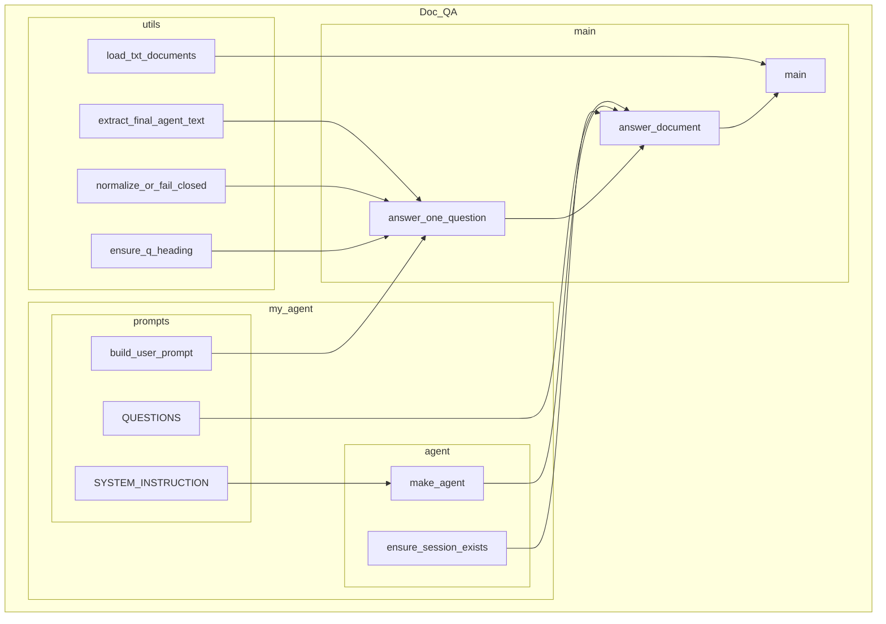

    

    <b>Automatic Architecture Diagrams from Code</b> 
    <a href="https://github.com/swark-io/swark">GitHub</a> • <a href="https://swark.io">Website</a> • <a href="mailto:contact@swark.io">Contact Us</a>

## Usage Instructions

1. **Render the Diagram**: Use the links below to open it in Mermaid Live Editor, or install the [Mermaid Support](https://marketplace.visualstudio.com/items?itemName=bierner.markdown-mermaid) extension.
2. **Recommended Model**: If available for you, use `claude-3.5-sonnet` [language model](vscode://settings/swark.languageModel). It can process more files and generates better diagrams.
3. **Iterate for Best Results**: Language models are non-deterministic. Generate the diagram multiple times and choose the best result.

## Generated Content
**Model**: GPT-4o - [Change Model](vscode://settings/swark.languageModel)  
**Mermaid Live Editor**: [View](https://mermaid.live/view#pako:eNqFVNtOwzAM_ZUqz9sP9AEJsT3sgaHR7gFRZGWNu0akSclFbEz7d9J1t14Cfkrs42PHPsqB5IohiUkmt5rWZZTOMhl5M27TOmYqh9Vj6-wEnOXC3PyNCUUZ2J0FpnJXobS9OO6sprmFgksqgG49Aqx3dlFS6YoK_oOgNBSUC8iFMsh6XNI4jfAFJVLG5fYWRclG2q32bcEuyzVca1XV_X4bW63nSbp4WSbDUPKWpPNnWCyT9HX91ICGmI3jgoEzqKEt0X8FCzQ00mxjFf1ECMTOIzFoDFcScMfNYAP39QKDolx2k6g0375_Jf24HRrryUcBl613gw0fFE7mTd57c_sYaeF0aI9DFUXT6UOX55wU0NMJH-w6pK-_s_p6C6Nb_FU398DuhIb6OT-0u-KBhP4rfSMI1x7Vyji8TRipF2bvOcf2RyakQr8Izvzvc8iILbHCjMRRRhgW1AmbkaMHuZpRizNOvTorElvtcEKosyrZy_xy18ptSxIXVBg8_gKTFomG) | [Edit](https://mermaid.live/edit#pako:eNqFVNtOwzAM_ZUqz9sP9AEJsT3sgaHR7gFRZGWNu0akSclFbEz7d9J1t14Cfkrs42PHPsqB5IohiUkmt5rWZZTOMhl5M27TOmYqh9Vj6-wEnOXC3PyNCUUZ2J0FpnJXobS9OO6sprmFgksqgG49Aqx3dlFS6YoK_oOgNBSUC8iFMsh6XNI4jfAFJVLG5fYWRclG2q32bcEuyzVca1XV_X4bW63nSbp4WSbDUPKWpPNnWCyT9HX91ICGmI3jgoEzqKEt0X8FCzQ00mxjFf1ECMTOIzFoDFcScMfNYAP39QKDolx2k6g0375_Jf24HRrryUcBl613gw0fFE7mTd57c_sYaeF0aI9DFUXT6UOX55wU0NMJH-w6pK-_s_p6C6Nb_FU398DuhIb6OT-0u-KBhP4rfSMI1x7Vyji8TRipF2bvOcf2RyakQr8Izvzvc8iILbHCjMRRRhgW1AmbkaMHuZpRizNOvTorElvtcEKosyrZy_xy18ptSxIXVBg8_gKTFomG)

